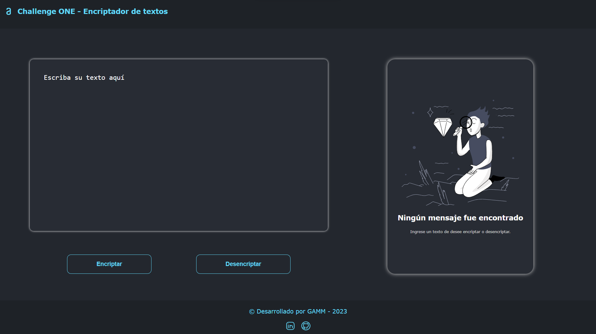
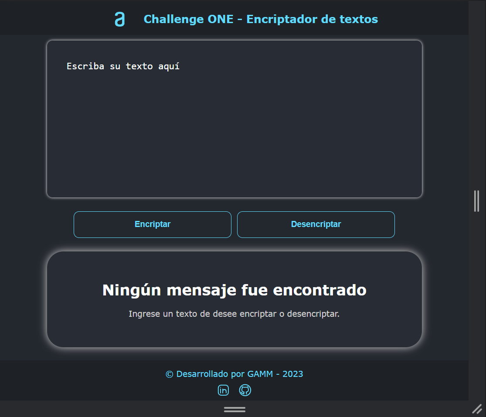
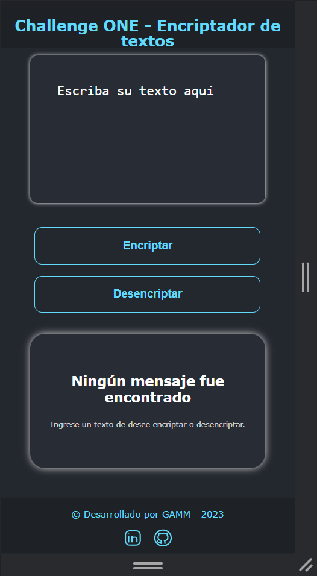

# Challenge encriptador de textos

### 📘Descripción

https://user-images.githubusercontent.com/116129111/235796359-d0b03497-b163-45ad-884b-9f2409e0aa66.mp4

 

> Este Challenge consiste en crear una _página web_ que pueda **_encriptar y desencriptar un texto ingresado_** por el usuario y mostrar dicho texto de forma encriptada o desencriptada. Challenge creado con los conocimientos adquiridos durante el curso de "Principiante En Programación".
---

**Tabla de contenidos**

[TOCM]

---

## 🧿Visualizaciones

### 💻 🖥️Desktop Responsive

### 📲Tablet Responsive

### 📱Mobile Responsive

## 🛠️ Lenguajes utilizados

</img>
 

## 📝 Requisitos

> Las **"llaves"** de encriptación que utilizaremos son las siguientes:

| Vocal ingresada | Vocal encriptada |
| :-------------: | :--------------: |
|  La letra `a`   |       `ai`       |
|  La letra `e`   |     `enter`      |
|  La letra `i`   |      `imes`      |
|  La letra `o`   |      `ober`      |
|  La letra `u`   |      `ufat`      |

- Debe funcionar solo con letras minúsculas
- No deben ser utilizados letras con acentos ni caracteres especiales
- Debe ser posible convertir una palabra para la versión encriptada también devolver una palabra encriptada para su versión original. Por ejemplo:

| Texto ingresado | Texto encriptado |
| :-------------: | :--------------: |
|     `gato`      |    `gaitober`    |

| Texto encriptado | Texto desencriptado |
| :--------------: | :-----------------: |
|    `gaitober`    |       `gato`        |

- La página debe tener campos para inserción del texto que será encriptado o desencriptado, y el usuario debe poder escoger entre las dos opciones.
- El resultado debe ser mostrado en la pantalla.
   

## 🌐 Link del proyecto

> Puedes visualizar el resultado [aqui](https://gamm95.github.io/challengeONE_encriptador/).
